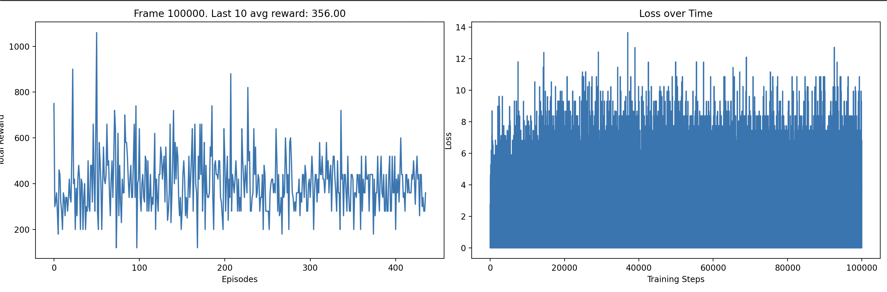

# DRL Models Riverraid Atari

This repository contains a set of scripts designed for training and evaluating different RL models on the "Riverraid-v5" environment from the Atari game suite, using Stable Baselines3 (SB3) (https://github.com/DLR-RM/stable-baselines3/tree/master). SB3 is a set of implementations of RL algorithms in PyTorch. The original work can be found in this paper: https://jmlr.org/papers/volume22/20-1364/20-1364.pdf by Raffin et al. The models used in this repo are Deep Q-Network (DQN), Proximal Policy Optimization (PPO), and Advantage Actor-Critic (A2C).


You can find this repository on my GitHub: [RL_Project](https://github.com/lisasth/RL_Project)


## Overview of project
### Scripts
The scripts for the Riverraid game including training, tests, comparison, and demos can be found in the folder "scripts". This folder has 3 subfolders: comparison, demo, and training. These include:
1. **training**:
- **train_models.py** trains A2C, PPO, and DQN models each for 1,000,000 timesteps. It initializes the Riverraid environment with frame stacking and uses vectorized environments to enhance the efficiency of the training process.

- **train_models_30_min.py** and **train_models_5_min.py** train the A2C, PPO, and DQN models for limited durations (30 minutes and 5 minutes, respectively). They adjust the number of timesteps accordingly (300,000 for 30 minutes and 50,000 for 5 minutes), providing insights into how the duration of training impacts the effectiveness of each model.

- **train_dqn_rgb.py**, **train_dqn_ram.py**, and **train_dqn_grayscale.py** each train a DQN model with different observation types: rgb, ram, and grayscale. These scripts highlight the model's adaptability to different types of input data and how these inputs affect the learning process.

- **train_dqn_by_scratch.py** was the initial setup to learn a DQN model by scratch using Pytorch. This was not used for the comparsison later on.

For all trained models, Weights and Biases (wandb) is used for monitoring the training process in an offline mode. This can be found here: https://wandb.ai/lisa-stuch/RL_Comparison?nw=nwuserlisastuch 


2. **comparison**
- **compare_ppo_dqn_a2c.py**, **compare_times.py**, and **compare_dqns.py** are used to evaluate and compare the performances of the trained models under different setups and training durations. They provide empirical data on the effectiveness of each training strategy and model configuration by plotting their performance metrics over 100 episodes.

3. **demo**
- **random_agent.py** runs a baseline agent that performs actions randomly in the environment. This script is used for establishing a performance baseline to compare against the trained models.

- **demo_agent_trained.py** demonstrates the performance of a trained DQN model by running it in the environment with visual rendering enabled. This script helps in visually assessing the model's decision-making capabilities in real-time.

### Other folders
The project contains some other folders:
- **models** includes all the trained models which are trained during this project. 
- **logs** contains all the logs which were created offline and then synchronized to wandb. 
- **images** contains all the images created and used in this project.


## Rules & Environment
For this repo I choosed the environment of Riverraid from the Gymnasium Framework (https://gymnasium.farama.org/environments/atari/riverraid/). This is an environment within the Atari game suite where the player controls a jet flying over a river. The objectives of the game are to destroy enemy objects (for points) and avoid running out of fuel by collecting fuel depots. These can also be destroyed to get points. Collisions with enemy objects or the river bank result in the loss of a jet. The game starts with three jets.

### Action Space
The game features a Discrete(18) action space with the following actions:

| Value | Action         | Value | Action         |
|-------|----------------|-------|----------------|
| 0     | NOOP           | 9     | DOWNLEFT       |
| 1     | FIRE           | 10    | UPFIRE         |
| 2     | UP             | 11    | RIGHTFIRE      |
| 3     | RIGHT          | 12    | LEFTFIRE       |
| 4     | LEFT           | 13    | DOWNFIRE       |
| 5     | DOWN           | 14    | UPRIGHTFIRE    |
| 6     | UPRIGHT        | 15    | UPLEFTFIRE     |
| 7     | UPLEFT         | 16    | DOWNRIGHTFIRE  |
| 8     | DOWNRIGHT      | 17    | DOWNLEFTFIRE   |


### Observation Space
The observation space depends on the type of observations used:

- **RGB**: Box(0, 255, (210, 160, 3), uint8)
- **RAM**: Box(0, 255, (128,), uint8)
- **Grayscale**: Box(0, 255, (210, 160), uint8)

### Rewards
Points are awarded for destroying various enemy objects as follows:

| Enemy Object | Score Points |
|--------------|--------------|
| Tanker       | 30           |
| Helicopter   | 60           |
| Fuel Depot   | 80           |
| Jet          | 100          |
| Bridge       | 500          |

Different variants of the Riverraid environment are available, varying by observation type, frameskip pattern, and repeat action probability. This information was taken from the Gymnasium website (https://gymnasium.farama.org/environments/atari/riverraid/).

## Initial Setup
I started the project initially with a custom implementation of DQN **dqn_by_scratch.py** using Pytorch. This model was designed to establish a baseline understanding of the challenges involved in training RL agents from high-dimensional visual input on this environment. The model employed a simple CNN architecture to process rgb observations from the game environment. The results were not promising, characterized by high variability in rewards and fluctuations in loss during training. This indicated difficulties in the agent learning effective strategies and in stabilizing the training process. Moreover, the training duration was excessively long (even though I trained on GPU). Given these challenges, I switched to the stable baselines3 library as mentioned before. Still, I wanted to include the DQN model from scratch and the results.



The plot illustrates the reward fluctuations and loss values over training episodes, highlighting the challenges faced and the initial insights gained from the experiment. This model trained for over 5 hours and around 400 episodes.


## Results
### Different models (PPO, A2C, DQN) and their performance
The performance of Riverraid has been already reported here https://www.endtoend.ai/envs/gym/atari/riverraid/. This was used as a guideline and to compare my results. First, I wanted to investigate the performance of different models, PPO, DQN, and A2C. To compare these models, I tested the trained agents on the Riverraid environment and ran tests for 100 episodes (with a skip frame of 4, this means that 25 results are obtained for each model). The results are shown below:


I used my **random agent** as a baseline (purple). It obtained an average score of 1498.20. So quite similar results to the paper, where it achieved 1338.5 (https://storage.googleapis.com/deepmind-media/dqn/DQNNaturePaper.pdf). This shows that I implemented the environment correctly and that the agent is able to explore the environment and collect rewards/ score points by destroying the objects.

Next, my **DQN agent** (green)(trained with the obs_type="rgb") achieved slightly worse results than reported in the paper of a best score of 7241 (https://arxiv.org/abs/1706.10295) and 8316 (https://storage.googleapis.com/deepmind-media/dqn/DQNNaturePaper.pdf). The best achieved results of my 25 recorded runs was around 5000, and the average was 2895. On the other hand, additional experiments were taken with different observation types (ram, grayscale and rgb), which are discussed later.

Additionally, I trained a **PPO agent** (blue). On the website mentioned above, the PPO agent scored 8393.6 (https://arxiv.org/abs/1707.06347). My best score on these runs was around 5000, and the average was 2593. PPO is a policy gradient method that balances the trade-off between exploration and exploitation by limiting the updates to the policy, aiming to achieve stable and efficient training.

The **A2C agent** (red) performed slightly worse than the PPO agent (https://arxiv.org/abs/1707.06347). I had similar results. My A2C agent achieved nearly 4000 as the highest score of the runs, and a lower avergae as PPO of 2471. A2C uses separate models for the policy (=actor) and value function (=critic), and updates them simultaneously to optimize decisions and evaluate potential benefits from those decisions. The poorer performance compared to PPO might be caused by the fact that PPO exhibits better sample efficiency. In the Riverraid environment data efficiency is crucial, and PPO might requires fewer samples to learn an effective policy compraed to A2C. Also, PPO can handle more complex policies due to its ability to perform multiple updates on a single batch of data, whereas A2C updates the policy once per rollout. Moreover, PPO is less sensitive to hyperparameters, and can be more easily parallelized across multiple GPUs. 

Comparing all 3 different models, DQN, PPO, and A2C, DQN outperformed both other models. This is also documented by https://www.endtoend.ai/envs/gym/atari/riverraid/. The good performance of the DQN model can be explained by the fact that DQN perfroms good in environments with sparse rewards due to its experience replay mechanism and efficient handling of delayed rewards. Additionally, it is designed for discrete action spaces which makes it effective in tasks where actions are categorical. DQN is a value-based method which estimates action values, whereas A2C and PPO are policy-based methods. The complex dynamics and high-dimensional action spaces of Riverraid possibly make value-based methods perform better than policy-based ones. Moreover, DQN uses experience replay and target networks which might enhances its stability and sample efficiency. Moreover, the epsilon-greedy exploration strategy can be advantageous when a high exploration rate is required.

To following table shows the perfornance of each model compared relatively to the random agent as a basline:

| Model       | Average score | Highest score | Improvement over random agent |
|-------------|---------------|---------------|-------------------------------|
| PPO         | 2564.00       | 4920          | +72.44%                       |
| A2C         | 2423.20       | 4060          | +62.94%                       |
| DQN         | 2906.00       | 5430          | +95.41%                       |
| Random      | 1487.30       | 2870          | Baseline                      |


## Investigating Different DQN Models
Next, I wanted to dive deeper into the DQN models. For doing this, I first read the paper Deep Reinforcement Learning with Double Q-learning by Hado van Hasselt, Arthur Guez, and David Silver (https://arxiv.org/abs/1509.06461). The results are shown below:  


These results show the training of different atari games with DQN and Double DQN for 30 minutes emulator time. As you can see, the DQN achieves similar results as I am achieving with the DQN model (around 4000).


### Different training times and their influence on performance
Next, I wanted to perform experiments on my models regarding the training time and how the training time would effect the performance of the model. Therefore, I trained the DQN agent for 5 min, and another agent for 30 min. The results are shown below:


The green line is the "normal" DQN agent from before which was trained for 1,000,000 timesteps until convergence. It achieved a highest score of around 5500, and an average score of 2942 for 100 runs. The red line shows the DQN agent trained for 30 min. YOu can see that the performance is worse with an average score of 1931.60, and a best score of 2800. So, the model's performance decreased by approximately 34.36%. The blue line represents the DQN agent trained for only 5 minutes, displaying significantly lower performance with a highest score slightly above 1000 and an average score of only 651.20 across the 100 episodes. This suggests that the limited training time severely restricts the agent's ability to learn effective strategies. The purple line depicts the random agent, which shows no learning over time and an average score of 1478.20, indicating the typical behavior expected without any strategic decision-making process. Comparatively, the DQN trained for 30 minutes shows better performance than the 5 minute and random agents but still underperforms against the fully trained DQN.

The following table summarizes the performance between the different DQN agents. The improvements are shown as a percentage increase over the random agent's performance:

| Agent           | Training duration | Average score | Improvement over random agent |
|-----------------|-------------------|---------------|-----------------------------|
| Fully trained DQN | 1,000,000 timesteps | 2942.00      | +99.30%                     |
| 30 min DQN      | 30 min (20,000 timesteps)        | 1931.60       | +30.68%                     |
| 5 min DQN       | 5 minutes (3,300 timesteps)         | 651.20        | -55.94%                     |
| Random agent    | None              | 1478.20       | Baseline                          |

- **The fully trained DQN** shows a huge improvement of 99.30% over the **random agent**. This shows the effectiveness of extensive training and the ability of the DQN agent to learn patterns and the Riverraid environment.
- **The 30 min trained DQN** also shows an improvement, scoring 30.68% higher than the **random agent**.
- **The 5 min trained DQN**, on the other hand, scores -55.94% lower than the **random agent**, indicating that minimal training can be less effective than random behavior in complex tasks since it had no time to learn patterns or rules of the enviornment.
- It can be infered that the longer the training is, the better the performance (up to a threshold/ convergence when there is no more improvement).

### Different observation types and their impact on the performance
Next, I wanted to further investigate the differences between the different observation types given for this environment, namley rbg, ram, and grayscale. I trained all of these agents for 1,000,000 timesteps and tested them on 100 episodes on the environment. The following graphic shows the results.


The green line is the standard DQN with the most common approach of the observation type "rgb". The pruple line has the observation type "ram", and the black line has observation type "grayscale". The random agent was also plottet to give a baseline and better overview (purple line). It provides a baseline with an average score of 1483.60, underscoring the complexity of Riverraid and the relative effectiveness of the DQN training. 

**DQN rgb** achieved the highest average score of 2706.80, demonstrating the efficacy of rich, detailed visual information provided by the RGB observation type. This format allows the model to utilize full-color visual cues, which are crucial for making informed decisions in Riverraid’s visually intricate setting. In this observation type, the agent receives observations as raw pixel values of the game screen in the rgb format and the observation space is represented as a 3D array with the shape (height, width, channels), where the channels represent the color channels (red, green, blue).

On the other hand, **DQN ram** recorded the lowest performance, with an average score of 260.80. The RAM observation type offers direct access to the game's internal state but interpreting this abstract data form can be challenging. The lack of visual cues, which are significant in Riverraid for distinguishing between objects and understanding game dynamics, likely harms the model's ability to perform well in this environment (and even worse than the random agent). This might hint that the agent learned wrong patterns which did not score any rewards. For this observation type, the environment "ALE/Riverraid-ram-v5" which is applicable for the ram observation type. Here, the observation space is represented as a 1D array with shape (128,), where each element corresponds to a byte of RAM, providing low-level information about the internal state. It cannot process visual observations because it cannot interpredet pixel data, but rather raw numerical values. Therefore, this agent was not able to learn patterns to adapt the game environment.

Finally, **DQN grayscale**, with an average score of 2362.40, showed that even with reduced complexity from color information, a good performance can be achieved. This model simplifies visual processing by eliminating color while retaining essential shape and movement information. Typically, frame skipping is employed in the default environments for the rgb and grayscale models, which affects decision frequency and learning efficiency. This can accelerate training and decrease sensitivity to minor environmental changes but might cause the model to overlook important events. In this environment I trained the grayscale agent using a different environment with no frame skippong: "RiverraidNoFrameskip-v4". This env processes every frame and allows for finer control and understanding of the game. However, this impacted the learning speed, which increased drastically compared to the rgb model with the "ALE/Riverraid-v5" environment. 

The difference between the performance between the ram and the two visual-based models (rgb and grayscale) suggest that visual features extracted from game are more beneficial for learning and decision-making in Riverraid than the numerical data provided by ram observations.

This table shows the performance comparison among the models. Improvements are calculated relative to the performance of a baseline random agent:

| Model         | Observation type | Average score | Improvement over random agent |
|---------------|------------------|---------------|-------------------------------|
| DQN rgb       | rgb              | 2706.80       | +83.18%                       |
| DQN ram       | ram              | 260.80        | -82.35%                       |
| DQN grayscale | grayscale        | 2362.40       | +60.29%                       |
| Random Agent  | -                | 1483.60       | Baseline                      |


## Wandb Reports


I used wandb to document my trainings. I only did this for the DQN model with rgb observation type, and the PPO model, as well as the A2C model. You might be confused why there are two models for each, the A2C and the PPO (namely the normal one, and a _continued_training one). This was due to the fact, that I first had a different script which would first train each model and then sets up a new model already with the knowledge of the first model. I am still using these models to showcase because it highlights the effects of this continued learning and shows a great improvement. 

The runs can be found in this repo: https://wandb.ai/lisa-stuch/RL_Comparison?nw=nwuserlisastuch 

I created a report for all models and all runs: https://wandb.ai/lisa-stuch/RL_Comparison/reports/Riverraid-Models-Comparison--Vmlldzo4MjUwMzk5 and one for the DQN model: https://wandb.ai/lisa-stuch/RL_Comparison/reports/DQN-Model-RGB--Vmlldzo4MjUwMjgy and one for the PPO and A2C model: https://wandb.ai/lisa-stuch/RL_Comparison/reports/PPO-and-A2C-Training--Vmlldzo4MjUwMTgw

If something is unclear please refer to this README, which should explain every step taken. 

## Dependencies

- Python 3.8+
- gymnasium
- stable-baselines3
- torch
- matplotlib
- wandb

Ensure all dependencies are installed using the following command:
```bash
pip install gymnasium stable-baselines3 torch matplotlib wandb
